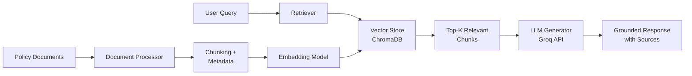

# Credit Scoring RAG System 🏦

A production-ready **Retrieval-Augmented Generation (RAG)** system designed to answer questions about internal credit policies, scoring rules, and underwriting guidelines with high accuracy and minimal hallucination.

## 📋 Table of Contents

- [Overview](#overview)
- [Features](#features)
- [System Architecture](#system-architecture)
- [Prerequisites](#prerequisites)
- [Installation](#installation)
- [Configuration](#configuration)
- [Usage](#usage)
- [Data Sources](#data-sources)
- [Testing](#testing)
- [Project Structure](#project-structure)
- [API Reference](#api-reference)
- [Troubleshooting](#troubleshooting)
- [Contributing](#contributing)

## 🎯 Overview

This Credit Scoring Policy Assistant leverages RAG technology to provide accurate, source-backed answers to questions about:

- **Credit scoring requirements** (minimum scores, risk categories, rate tiers)
- **Underwriting policies** (documentation requirements, loan structure, conditional approvals)
- **Risk assessment guidelines** (DTI ratios, collateral requirements, industry classifications)

### Key Benefits

✅ **High Accuracy**: Retrieves exact thresholds from source documents  
✅ **Zero Hallucination**: All responses are grounded in actual policy documents  
✅ **Source Attribution**: Every answer includes citations to source material  
✅ **Trustworthy**: Designed for fintech compliance and risk management  

## ✨ Features

- **Semantic Search**: Uses advanced embeddings to find relevant policy sections
- **Intelligent Chunking**: Optimally splits documents to preserve context
- **Multi-Format Support**: Handle **Markdown (.md)** and **PDF (.pdf)** documents
- **Interactive UI**: Clean Streamlit interface for easy interaction
- **Dynamic Ingestion**: Upload and index new documents directly from the UI
- **Confidence Scoring**: Provides confidence levels for each answer
- **Debug Mode**: View retrieved chunks and relevance scores
- **Evaluation Metrics**: Built-in tools to measure accuracy and quality

## 🏗️ System Architecture



### Components

1. **Document Processor**: Loads and chunks policy documents
2. **Vector Store**: ChromaDB with sentence-transformers embeddings
3. **Retriever**: Semantic search with similarity filtering
4. **LLM Handler**: Groq API integration for response generation
5. **RAG Pipeline**: Orchestrates retrieval + generation workflow
6. **Streamlit UI**: User-friendly web interface

## 📦 Prerequisites

- **Python**: 3.8 or higher
- **Groq API Key**: Sign up at [groq.com](https://groq.com)
- **Operating System**: macOS, Linux, or Windows

## 🚀 Installation

### 1. Clone the Repository

```bash
git clone <repository-url>
cd credit-scoring-rag
```

### 2. Create Virtual Environment

```bash
# Using venv
python -m venv venv

# Activate virtual environment
# On macOS/Linux:
source venv/bin/activate

# On Windows:
venv\Scripts\activate
```

### 3. Install Dependencies

```bash
pip install -r requirements.txt
```

### 4. Set Up Environment Variables

```bash
# Copy the example environment file
cp .env.example .env

# Edit .env and add your Groq API key
nano .env  # or use your preferred editor
```

## ⚙️ Configuration

Edit the `.env` file to customize system behavior:

```bash
# Groq API Configuration
GROQ_API_KEY=your_api_key_here
GROQ_MODEL=llama-3.1-70b-versatile

# Embedding Model
EMBEDDING_MODEL=all-MiniLM-L6-v2

# RAG Configuration
CHUNK_SIZE=1000              # Characters per chunk
CHUNK_OVERLAP=200            # Overlap between chunks
TOP_K_RETRIEVAL=5            # Number of chunks to retrieve
SIMILARITY_THRESHOLD=0.7     # Minimum similarity score

# ChromaDB Configuration
CHROMA_PERSIST_DIR=./chroma_db
```

### Configuration Parameters

| Parameter | Description | Default | Recommended Range |
|-----------|-------------|---------|-------------------|
| `CHUNK_SIZE` | Size of text chunks | 1000 | 500-2000 |
| `CHUNK_OVERLAP` | Overlap between chunks | 200 | 100-300 |
| `TOP_K_RETRIEVAL` | Number of chunks retrieved | 5 | 3-10 |
| `SIMILARITY_THRESHOLD` | Minimum relevance score | 0.7 | 0.6-0.85 |

## 💻 Usage

### Initial Setup: Ingest Documents

Before using the system, you need to process and index the policy documents:

```bash
python src/ingest_documents.py
```

This will:
- Load all markdown files from `data/raw/`
- Split documents into chunks
- Generate embeddings
- Store in ChromaDB vector database

**Expected Output:**
```
Processing documents...
✓ Loaded: credit_scoring_manual.md (195 lines)
✓ Loaded: risk_assessment_guidelines.md (404 lines)
✓ Loaded: underwriting_policies.md (494 lines)

Creating embeddings...
✓ Generated 127 chunks
✓ Indexed in ChromaDB

Ingestion complete!
```

### Run the Streamlit Application

```bash
streamlit run src/app.py
```

The application will open in your browser at `http://localhost:8501`.

### Uploading New Documents

In addition to static ingestion via `ingest_documents.py`, you can:
1.  **Open the sidebar** in the Streamlit app.
2.  **Upload PDF or Markdown files** in the "Add Documents" section.
3.  Click **🚀 Ingest Uploaded Files** to index them immediately without restarting the app.

### Example Queries

Try these queries to test the system:

**Credit Scores:**
- "What is the minimum credit score for FHA loans?"
- "What are the credit score requirements for jumbo loans?"

**DTI Ratios:**
- "What is the maximum DTI ratio for conventional mortgages?"
- "What compensating factors allow higher DTI ratios?"

**Documentation:**
- "What income documentation is required for self-employed borrowers?"
- "What are the reserve requirements for investment properties?"

**Underwriting:**
- "What are the waiting periods after bankruptcy?"
- "What is the maximum LTV for primary residence with a 650 credit score?"

### Programmatic Usage

```python
from src.rag_pipeline import RAGPipeline

# Initialize the RAG system
rag = RAGPipeline()

# Ask a question
response = rag.query("What is the minimum credit score for FHA loans?")

# Access the answer
print(response['answer'])

# View sources
for source in response['sources']:
    print(f"Source: {source['document']} (Score: {source['similarity']:.2f})")
    print(f"Content: {source['text']}\n")
```

## 📚 Data Sources

The system uses three comprehensive policy documents:

### 1. Credit Scoring Manual
- Credit score ranges and risk categories
- Minimum score requirements by product
- Interest rate tiers
- Credit history requirements
- Payment history standards

### 2. Risk Assessment Guidelines
- Debt-to-Income (DTI) ratio standards
- Loan-to-Value (LTV) requirements
- Industry risk classifications
- Income verification standards
- Liquid reserves requirements
- Geographic risk factors

### 3. Underwriting Policies
- Documentation requirements (credit, income, assets)
- Property documentation standards
- Loan structure requirements
- Automated underwriting systems
- Special program guidelines
- Conditional approval standards

**Location**: `data/raw/*.md`

### Adding New Documents

1. Place markdown files in `data/raw/`
2. Run the ingestion script:
   ```bash
   python src/ingest_documents.py
   ```

## 🧪 Testing

### Run All Tests

```bash
# Run all tests with verbose output
python -m pytest tests/ -v

# Run with coverage report
python -m pytest tests/ --cov=src --cov-report=html

# View coverage report
open htmlcov/index.html
```

### Run Specific Test Suites

```bash
# Test document processing
python -m pytest tests/test_document_processor.py -v

# Test retrieval system
python -m pytest tests/test_retriever.py -v

# Test end-to-end RAG pipeline
python -m pytest tests/test_rag_pipeline.py -v
```

### Evaluation Metrics

Run the evaluation suite to measure system performance:

```bash
python src/evaluator.py
```

**Metrics:**
- **Answer Accuracy**: Percentage of correct answers
- **Source Attribution**: Percentage of answers with valid citations
- **Hallucination Rate**: Percentage of unsupported claims
- **Retrieval Precision**: Relevance of retrieved chunks
- **Response Time**: Average query processing time

**Target Metrics:**
- Answer Accuracy: > 90%
- Source Attribution: > 95%
- Hallucination Rate: < 5%
- Average Response Time: < 3 seconds

## 📁 Project Structure

```
credit-scoring-rag/
│
├── data/
│   ├── raw/                          # Source policy documents
│   │   ├── credit_scoring_manual.md
│   │   ├── risk_assessment_guidelines.md
│   │   └── underwriting_policies.md
│   └── processed/                    # (Future) Processed data
│
├── src/
│   ├── __init__.py                   # Package initialization
│   ├── config.py                     # Configuration management
│   ├── document_processor.py         # Document loading and chunking
│   ├── vector_store.py               # ChromaDB management
│   ├── retriever.py                  # Semantic search
│   ├── llm_handler.py                # Groq API integration
│   ├── rag_pipeline.py               # Main RAG orchestration
│   ├── evaluator.py                  # Evaluation metrics
│   ├── ingest_documents.py           # Document ingestion script
│   └── app.py                        # Streamlit application
│
├── tests/
│   ├── test_document_processor.py
│   ├── test_retriever.py
│   ├── test_rag_pipeline.py
│   └── test_data.py
│
├── chroma_db/                        # Vector database (generated)
├── .env                              # Environment variables (create from .env.example)
├── .env.example                      # Example environment configuration
├── .gitignore                        # Git ignore rules
├── requirements.txt                  # Python dependencies
└── README.md                         # This file
```

## 📖 API Reference

### RAGPipeline

Main class for interacting with the RAG system.

```python
class RAGPipeline:
    def __init__(self, config_path: str = None)
    def query(self, question: str, top_k: int = 5) -> dict
    def reload_documents(self) -> None
```

**Methods:**

- `query(question, top_k)`: Process a user query and return answer with sources
  - **Parameters:**
    - `question` (str): The user's question
    - `top_k` (int): Number of context chunks to retrieve
  - **Returns:** Dictionary with `answer`, `sources`, `confidence`

- `reload_documents()`: Refresh the vector database with latest documents

### VectorStore

Manages the ChromaDB vector database.

```python
class VectorStore:
    def __init__(self, persist_directory: str, embedding_model: str)
    def add_documents(self, documents: List[str], metadatas: List[dict]) -> None
    def similarity_search(self, query: str, k: int, threshold: float) -> List[dict]
```

### DocumentProcessor

Handles document loading and chunking.

```python
class DocumentProcessor:
    def __init__(self, chunk_size: int, chunk_overlap: int)
    def load_documents(self, directory: str) -> List[Document]
    def split_documents(self, documents: List[Document]) -> List[Document]
```

## 🔧 Troubleshooting

### Common Issues

**Issue: "ModuleNotFoundError: No module named 'src'"**
- **Solution**: Ensure you're running commands from the project root directory and the virtual environment is activated.

**Issue: "Groq API authentication failed"**
- **Solution**: Verify your `GROQ_API_KEY` in the `.env` file is correct.

**Issue: "ChromaDB database not found"**
- **Solution**: Run the ingestion script: `python src/ingest_documents.py`

**Issue: "Low-quality or hallucinated answers"**
- **Solutions**:
  - Increase `SIMILARITY_THRESHOLD` (e.g., 0.75 or 0.8)
  - Increase `TOP_K_RETRIEVAL` to get more context
  - Reduce `CHUNK_SIZE` for more granular retrieval

**Issue: "Slow query response time"**
- **Solutions**:
  - Reduce `TOP_K_RETRIEVAL` if too many chunks are retrieved
  - Consider using a faster embedding model
  - Check network latency to Groq API

### Debug Mode

Enable debug logging to see detailed information:

```python
import logging
logging.basicConfig(level=logging.DEBUG)

from src.rag_pipeline import RAGPipeline
rag = RAGPipeline()
response = rag.query("your question")
```

## 🤝 Contributing

Contributions are welcome! Please follow these guidelines:

1. **Fork** the repository
2. **Create a branch** for your feature (`git checkout -b feature/amazing-feature`)
3. **Write tests** for new functionality
4. **Ensure all tests pass** (`pytest tests/`)
5. **Commit your changes** (`git commit -m 'Add amazing feature'`)
6. **Push to the branch** (`git push origin feature/amazing-feature`)
7. **Open a Pull Request**

## 📄 License

This project is intended for internal use only. All policy documents are confidential and proprietary.

---

## 🔮 Future Enhancements

- [x] PDF Document Support
- [x] Dynamic File Upload via UI
- [ ] Multi-language support
- [ ] Advanced reranking models (e.g., Cross-Encoder)
- [ ] Query history and analytics dashboard
- [ ] Fine-tuned embedding models on domain-specific data
- [ ] Integration with external policy management systems
- [ ] REST API for programmatic access
- [ ] Automated policy update notifications

---

**Version**: 1.0.0  
**Last Updated**: January 2026  
**Contact**: [Your Team/Department]
