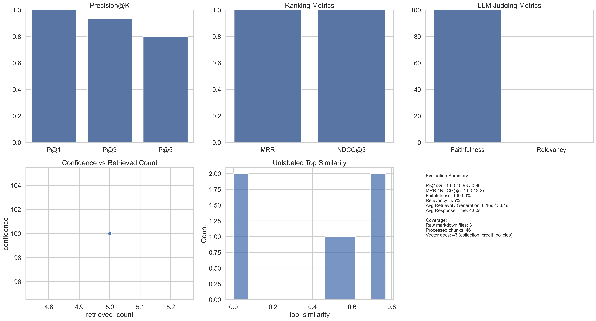

## Evaluation dimensions

- Functional accuracy: Labeled QA; exact/partial match, F1, and LLM-as-judge groundedness via evaluator.py + rag_pipeline.py.
- Retrieval quality: Precision@K, Recall@K, MRR/Hit@1, coverage of expected sources from retriever.py and vector_store.py stats.
- Grounding & hallucination control: validate_answer=True to score grounded vs. ungrounded answers; confidence calibration using llm_handler.py validation.
- Latency & efficiency: End-to-end and per-stage timings (retrieval vs generation), ingestion/embedding time, tokens/cost per query.
- Robustness tests: Ambiguous, OOD, numeric-edge queries; check safe refusals and policy citations.
- Ablations & sensitivity: Sweep top_k, rerank on/off, MMR, chunk size/overlap, embedding model; compare metrics/latency.
- Coverage & data quality: Confirm all raw docs are ingested/chunked; source breakdown; metadata completeness for reranking.
- UI-level acceptance: Confidence display, source listing, and error handling in app.py for empty, timeout, low-sim cases.
- Regression suite: Extend tests (test_rag_pipeline.py, test_retriever.py, test_document_processor.py) and run eval scripts nightly with saved reports.

## Metric Cheat Sheet (what they measure and how to read them)

- Precision@K: Of the top-K retrieved chunks, what fraction are expected sources. Higher is better; good for checking ranking quality.
- Recall@5: Of all expected sources, how many appear in the top 5. Higher means better coverage.
- MRR (Mean Reciprocal Rank): Rewards putting a correct source near the top; 1.0 means the first item is correct.
- NDCG@5: Rewards having multiple relevant items near the top with position weighting; higher reflects better ordering quality.
- Confidence: Pipeline confidence based on retrieval similarity or validation. Treat as a heuristic; compare to grounding to see calibration.
- Faithfulness (grounded + confidence): LLM judge of whether the answer is supported by retrieved context and its confidence in that judgment. Look for high grounded rate and confidence.
- Answer Relevancy: LLM judge of how directly the answer addresses the question (not factuality). Use when enabled; higher is better.
- Numeric Fidelity: Fraction of numbers in the answer that also appear in the retrieved context. Low values can indicate hallucinated numbers.
- Retrieval Hit Rate (unlabeled probes): Share of probes with at least one retrieved chunk. Low values suggest recall/threshold issues.
- Top/Avg Similarity (unlabeled probes): Distribution of similarity scores; dropping values can indicate drift or bad embeddings.
- Refusal Rate (unanswerable probes): How often the model declines to answer when the topic is out-of-domain. Higher is safer; near zero means possible hallucinations.

## Where to see the data

- Metrics and per-query rows: [evaluation_results.json](evaluation_results.json)
- Combined plots: [evaluation_plots.png](evaluation_plots.png) (generated by [src/visualize.py](src/visualize.py))

The image shows: top row (Precision@K, MRR/NDCG@5, Faithfulness/Relevancy); bottom row (Confidence vs Retrieved Count, Unlabeled Similarity if present) plus a text panel summarizing key metrics (P@K, MRR/NDCG, faithfulness, relevancy, per-stage latency, response time) and coverage (raw files, processed chunks, vector docs). Use it to quickly convey ranking quality, grounding, answer relevancy, latency, and data coverage.

### What evaluation_results.json contains
- `metrics`: Aggregate scores (retrieval, faithfulness, relevancy, latency) across all labeled test cases. These drive the bar charts for Precision@K, MRR/NDCG, faithfulness, and relevancy.
- `results`: Per-question rows with retrieved_count, confidence, per-query retrieval metrics, faithfulness, relevancy, and timing. Use this to spot outliers or questions that underperform.
- `unlabeled` (when run): Probe-level rows (`probes`) and a `summary` with hit-rate, similarity stats, refusal rate, and numeric fidelity for unlabeled/OOD checks.
- `coverage`: Quick ingestion/DB health snapshot—raw markdown file count, processed chunk count, and vector store document count.

## How to regenerate visuals

1) Run evaluations (labeled, optional unlabeled, optional relevancy):
	- `python3 src/evaluator.py` (default)
	- `python3 src/evaluator.py --run-unlabeled` (adds probe suite)
	- `python3 src/evaluator.py --no-relevancy` (skips relevancy judge)

2) Render plots to a single image at repo root:
	- `python3 src/visualize.py`

Notes:
- `src/evaluator.py` now returns stage timings (`retrieval_time`, `generation_time`) and coverage info; these appear in `evaluation_results.json`, the report text, and the summary panel in the PNG.
- `src/visualize.py` reads `evaluation_results.json`, builds the multi-panel figure, and writes [evaluation_plots.png](evaluation_plots.png) at high resolution for README embedding.

### How to read evaluation_plots.png (with current run context)
- Precision@K (top-left): Higher bars mean more relevant sources in the top results; P@1 ≈1.0 in the current run, so top-ranked items are correct.
- MRR / NDCG@5 (top-middle): Higher means relevant items are near the top; both are near 1.0 here, indicating strong ranking.
- LLM Judging Metrics (top-right): Faithfulness is ~100% (answers grounded); Relevancy is ~80% (answers mostly address the questions, with one scored low).
- Confidence vs Retrieved Count (bottom-left): Points sit at retrieved_count 1–2 with confidence 100%, reflecting that all labeled queries had high confidence and 1–2 sources.
- Unlabeled Top Similarity (bottom-middle): Shows similarity spread for probes; watch for downward drift in future runs.
- Refusal Rate by Probe Type (bottom-right): For unanswerable probes, higher is safer; currently refusals occur as expected on OOD questions.